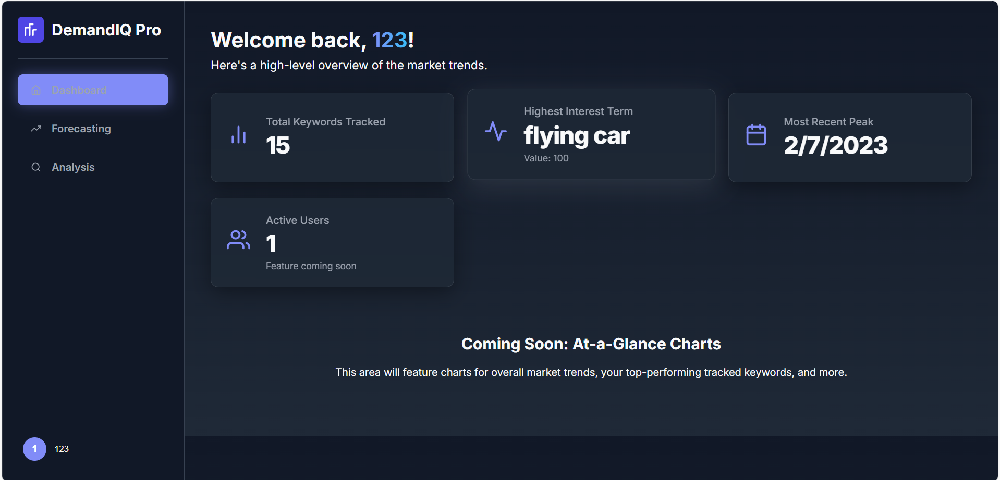
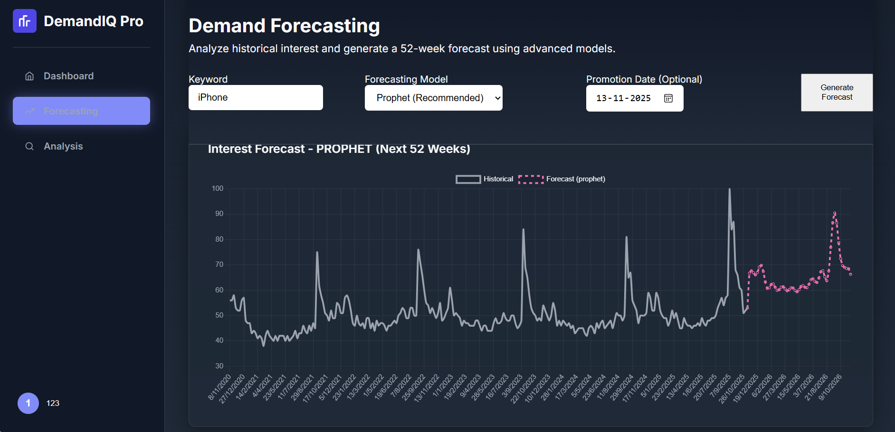
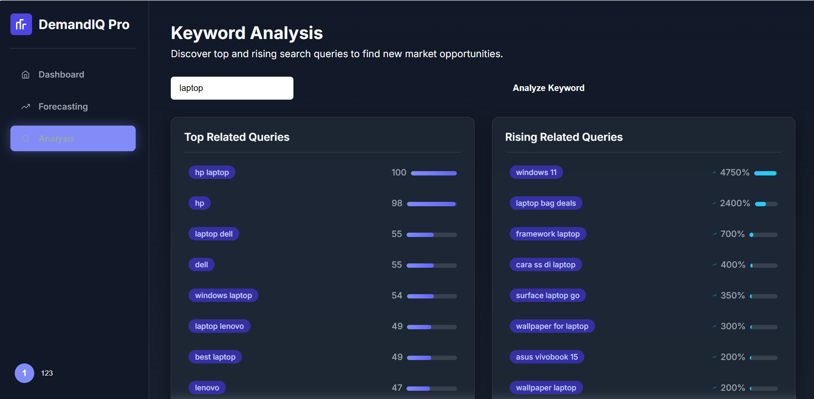

# DemandIQ Pro 📈

**DemandIQ Pro** is an enterprise-grade business intelligence dashboard designed for advanced demand planning and inventory forecasting. It empowers businesses to move beyond simple historical analysis by integrating internal sales data with external public interest trends from Google, providing a comprehensive and more accurate prediction of future demand.

The application features a modern, card-based interface with a sleek dark mode, interactive charts, and a full suite of analytical tools to help supply chain managers make smarter, data-driven decisions about inventory.

---

## ✨ Core Features

*   **Secure User Authentication:** Full user registration and login system using secure JWT for access control.
*   **Data Management Hub:** An intuitive interface for users to upload their own historical sales data in CSV format, populating the application with their unique business context.
*   **Sales Analysis Dashboard:** An overview page with KPIs and charts that visualize key sales metrics like total revenue, best-selling products, and overall sales trends.
*   **Advanced Inventory Forecasting:**
    *   **Dual-Model Prediction:** Users can choose between two powerful forecasting models: **Prophet** (ideal for seasonal data) and **XGBoost** (for learning complex relationships).
    *   **Google Trends Integration:** Enhance forecast accuracy by correlating internal sales data with external public search interest for a product or category.
    *   **Promotion Simulation:** A "what-if" analysis tool allowing users to input future promotion dates and expected sales uplift to visualize the impact on demand.
*   **Fully Containerized:** The entire stack is managed with Docker and Docker Compose for easy, one-command setup and deployment.

---

## 🔧 Tech Stack

This project is a modern, decoupled web application.

#### **Backend**
*   **Framework:** **FastAPI**
*   **Database:** **PostgreSQL** with **SQLAlchemy** (ORM)
*   **Authentication:** **JWT** (JSON Web Tokens) with Passlib
*   **Forecasting Models:** `Prophet` (from Meta), `XGBoost`
*   **External Data:** `pytrends` for Google Trends API
*   **Deployment:** Gunicorn & Uvicorn within a Docker container

#### **Frontend**
*   **Framework:** **React** (with Vite)
*   **Routing:** **React Router**
*   **Styling:** Custom CSS with CSS Variables for theme switching
*   **State Management:** React Context API (for Auth & Theme)
*   **Deployment:** Served via **Nginx** in a Docker container

#### **Infrastructure**
*   **Containerization:** **Docker** & **Docker Compose**

---

## 🚀 Getting Started

Follow these instructions to get the project up and running on your local machine.

### Prerequisites

*   **Docker** and **Docker Compose** must be installed and running.
*   **Git** installed for cloning the repository.
*   **Node.js** and **npm** installed locally (required for `npm install` to enable editor intellisense).

### Installation & Setup

1.  **Clone the repository:**
    ```bash
    git clone https://github.com/YourUsername/DemandIQ-Pro.git
    cd DemandIQ-Pro
    ```

2.  **Configure Environment Variables:**
    *   Navigate to the root directory of the project.
    *   Create a `.env` file by copying the example: `cp .env.example .env` (or just create the file manually).
    *   Open the `.env` file and **change `SECRET_KEY` and `POSTGRES_PASSWORD`** to your own unique, secure values.

3.  **Install Frontend Dependencies:**
    *   This step is necessary for your local code editor to provide proper support.
    ```bash
    cd frontend
    npm install
    cd .. 
    ```

4.  **Build and Run with Docker Compose:**
    *   From the project's root directory, run the following command. This will build the Docker images and start all the services.
    ```bash
    docker-compose up --build
    ```

### Accessing the Application

*   **Frontend Website:** Open your browser and navigate to **`http://localhost:5173`**
*   **Backend API Docs:** The FastAPI interactive documentation is available at **`http://localhost:8000/docs`**

You can now register a new user, log in, and start using the DemandIQ Pro application.

---
---

## 📸 Application Screenshots

Showcasing the sleek, modern, and animated interface of DemandIQ Pro. The entire application supports a beautiful mode for a better user experience.

### Main Dashboard
*(Provides a high-level overview of key metrics with animated, "glassmorphism" styled KPI cards.)*
<div align="center">
  
</div>

### Advanced Demand Forecasting
*(The core forecasting tool, showing historical data for "iPhone" and a 52-week future prediction using the Prophet model. The chart is fully interactive with zoom and pan functionality.)*
<div align="center">
  
</div>

### Keyword Opportunity Analysis
*(The analysis page, demonstrating "Top" and "Rising" related queries for the term "laptop". This view uses pill-shaped chips and progress bars to visualize emerging trends.)*
<div align="center">
  
</div>

---
